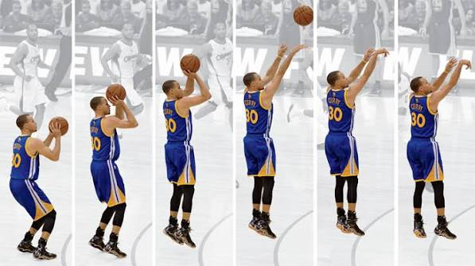
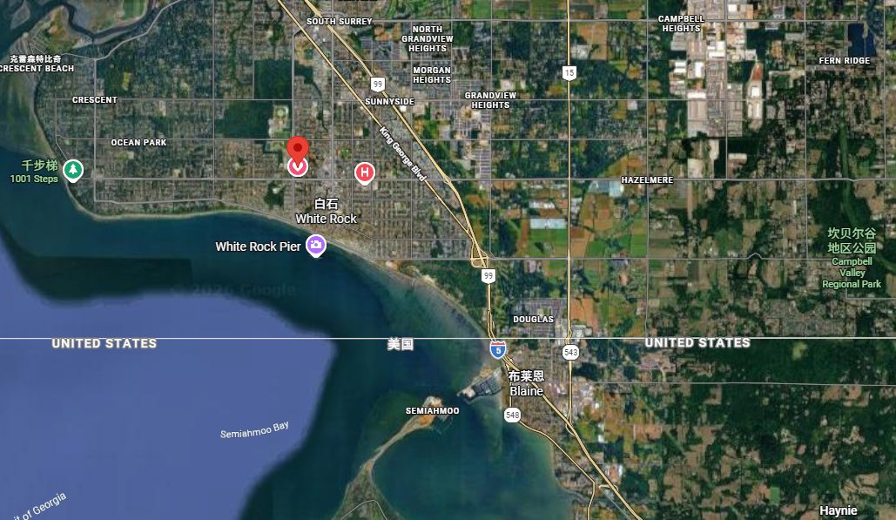
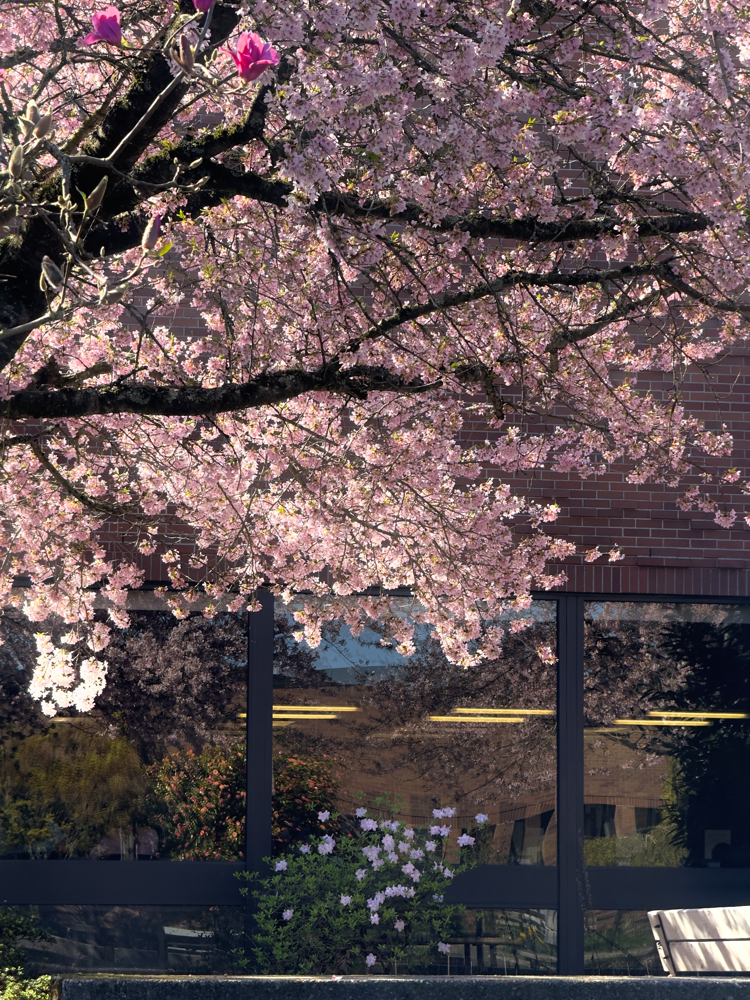

#  Some Word to Tequila 

## 一些说明：
> 这些话（几乎每部分的开头）是在9月4号坐飞机或者等飞机的时候写的，后面到了那边又继续写了一点。
不求你看，不想看的就直接跳过，就当我发牢骚了
I really open up, as a man 
: |

---

## 关于回来

关于回来，这次回来本身无疑是很开心的（现在似乎不在意了），回家是最好的暑假礼物。自认为我是一个很在意家和自己的根在哪里的人。
 
喝了奶茶（其实没有很喜欢喝），吃了好吃的，但是没人陪我打篮球，我初中那帮同学一个都没有空，有几个靠特殊手段进网吧的，还有几个说补课没空的，反正就是没人陪我打
：（

本身这个暑假不该回去的，但是你说要请我吃饼加上想跟初中同学打篮球，所以选择回来了。No kidding，真的哦。所以可以想象10号台风见不到你又没人陪我打球的绝望了吧。（跟一只失望的小狗一样可怜）

其实后面全在复习雅思，回不回没区别。

你是我唯一一个在暑假里见到的除家人以外的见到能让我开心的人呢，所以爱你龙姐：）。 你看上去变化不大欸，依旧是我记忆里最美的模样。（我以为你会变衰老一点，看来平时养护的挺好，开心）
我回来就马上适应了杭州的生活，感觉一切都没变，当然我离开了xj。

 

## 细说离开

我适应新的环境很快，但是适应的方式不是很好。

我的脑子感觉在删除/刻意隐藏所有过往的记忆（特别是没有人作为记忆对象来remind me）。

所以当我到ca我就像是一个全新的人格甚至是新的人，然后回到杭州也会切换(vice versa)。

我的记忆在事实上肯定是存在的且是可唤起的，但是我在一个区域时，在另外一个区域的记忆就会被自动隐去（变成灰色）。所以在ca有时候会觉得自己很空虚，啥都没经历（其实正常，国内的经历在这里ca没啥用）

简单说就是比较专注于目前环境以至于忘记以前的经历，我真的觉得我没回过杭州。感觉暑假变成了历史，时间越过越快，应该是年纪大了导致的（对时间的感知变了）

但是那些回忆的画面感觉在褪色，从鲜艳到灰色（现在还没变纯灰），我总是记得我在三楼吃汤面，坐在西边的那一片，然后有几个人陪着我，窗外的光线有些变暖了，有时还能看到天边太阳直射的光。然后面很香，而且吃面的时候总有些有意思的东西可以聊。八卦，电脑，王者荣耀……

我明显感觉高一比ca的高二经历了更多，美好也更多，ca这里这一年感觉在虚度光阴。

你就像两个世界的唯一的桥，沟通两个世界。一边是学习二次函数的无聊数学课，一边是一日之计在于晨的吓人数学题，这很魔幻。

还有，开挂的学校生活其实没什么意思。

 

## 关于那边的生活

关于那边，就这一年来讲，其实我并没有待的很舒服。你知道的，温哥华，都有个“温”字了，临海，东部北部有洛基山脉挡着，气温在冬天里没有低的夸张，但是秋冬季节有无止境的雨，所以当时暑假过去晴了一个半月之后就一直是阴雨绵绵。我讨厌雨，衣服湿了很烦，而且基本没有晴天来晒衣服。而且因为长时间的雨季，天一直是灰色的，导致万物看起来都是灰色的（感觉鲜艳的颜色都消失了，阴气重），人自然就不会很开心。还好第一学期有体育和法律，两门还算比较开心的课。

法律课学的是ca的法律，还是很酷的，如买毒违法但是吸毒不违法，之前政府还在温哥华市中心开过一个专门给毒贩吸毒的场所，总之呆在那边了解总比不了解好。老师还说我是best student：），当然没你们文科背的这么多。

体育课就是出去打各种球，体验了一下棒球和橄榄球，确实氛围是不一样的，当然打的不好就是了，篮球打的很爽，也体验了一下库里是怎么被对待的了，被几个大汉贴着防：），那边的场地非常好，木地板会反着油光，感觉篮筐也更大（三分线距离更近是事实）。还有就是每天上课都听霉的新专是真的会听厌。

当然这是第一个学期，第二学期情况稍有不同罢了。

 

第二个学期全是主课，数物化

数学课我跟老师的故事你也知道了，当然还是描述一下他吧，他是一个精神面貌极好的年迈老师，六十左右，长得很板正，平时笑起来感觉很有智慧（毕竟哈佛数学系的）。但是但是但是，他每次对我笑的时候完全不一样，是那种和蔼但看上去有点尴尬的笑，还有点像是寻求肯定的意思（纯自大的幻想），反正我看到一秒就不敢继续对视了。太尴尬了😅

化学老师是女印度人，当老师是她的part time job，教的是初中的内容，很无聊就是了，人不错，但很逆天的就是她靠诊断书期末一个半月没来。所以有机化学是我和另外一个人教班里的中国人的。

这里提到有机化学还是想喷一下杨俊啊，想到就气，上的啥狗屎东西，拿工资就会翻个ppt。

物理老师很帅（现在剪头发了），上课主要在跟Kevin玩游戏。打台球，打战争模拟器，然后讨论晚上啥时候打csgo。（只有他陪我打游戏了，就连我弟都不愿意周末陪我玩一下）

第二个学期，也就是春夏季节，天气还是很好的。全是晴天，每天太阳都不错，天真的很蓝。那边的植物感觉绿色更深，所以阳光照上去看上去会更有活力一点，总的来说春夏的风景的确不错。

 

就像我跟你讲的，那边学习氛围并不好，当然对当地人来说学校不是全部。不知你是否听过“cramming”这个词，意思是考前疯狂复习，临时抱佛脚，那边很多人都是这样，上课不学考前cramming，更有些直接放弃自己的。当然ca并不是精英教育，我的上的也是公校，这种情况合理但我不喜欢这样的氛围。

我感触很深的是物理，我坐在第三排，前两排全是女生，基本没人上课认真学的，全在聊八卦，关键教的东西不难啊，结果她们考试全考不出来，然后就抱怨题出的太难。我们的老师脾气很好的，但是还是被这帮人惹生气。（有几次看不下去了我就直接在课上质问有人听课吗）

这里上学的感觉跟国内不一样，我更多的是去课上拿高分，而不是真去学东西（理科）。当然法律还是非常有意思的。

 

## 关于一些对学习的想法

我更喜欢学军。虽然累，但我觉得这一年过的充实（至少学到东西了），也一直有一帮人陪着（ca地广人稀）而且正常来说，你要跟一帮人一起至少过两年，这群人一直一起跟你上课，有人陪你吃饭，有人陪你从日出到日落（就像你的宝贝），这是ca不可能存在的。

不一样的是，那边的教育系统没有特别强调什么全面发展，没有学考（之前有的），只要学自己未来想报的专业的必须课就行了。有时我也会质疑国内的学考，就是我们学这么多东西，真的有必要吗？当然，我不知道，以后也大概不会知道的。

那边的学术诚信问题挺大的。情况是：基本没有人不作弊，甚至大考。我之前参加大学数学微积分考试跟Kevin一个考场，他考好出来问我为啥我不作弊。他还叫我考试穿宽松一点的裤子因为这样好放手机（他妈妈的秘诀）。

 

假假亦真真，真真亦假假

 

这里全是作弊的，特别是中国人，但这帮人却有可能去了最好的大学，反而让应该进去学习的被拦在门外，最后这帮人学历镀了金。

有可能现实情况没有这么严重，但是可能不公和虚假才是现实，就像你说的——“外面的世界” 。

当然多说点积极的，少抱怨不公。

 

ca的大学是有难度的（比xj简单），我比较喜欢的是运气好的话它会有安排实习（有钱拿）。当然以后希望回国工作（家里金主不是很支持我在外面）。

 

## 关于那边的日常生活   

那边的生活是有些机械且重复的，不知道有没有听到过一段描述：

> <i>每周五的傍晚，相伴着夕阳，你开着你的老敞篷跑车去到超市，买了一瓶两公升的可口可乐和一大袋速食鸡块，为什么是两公升呢？你从来没有思考过，它就应该是两公升。你站在速冻柜前忽然意识到你好像已经吃这个牌子七年了，这个牌子的鸡块没有那么优质，之前买的时候你还做着2000一个月的工作，想想就先这么将就一下，和你的车一样，当时想着以后会买更好的。你抱着你的可乐和鸡块走向你车的后备箱，看到停车场的另一条道子上有辆购物车在向前滑行，你想去让它停下，但是你又想了一想，似乎这个购物车比你更知道应该去哪里。</i>

这一年我的每周生活也跟上面差不多了，当然我不是白人，晚饭绝对不是鸡块。每天的晚饭基本全是由我烧的，感觉自己还算有点天赋，啥都能做（不会的就看小红书嘿嘿）。烧饭这件事还是挺花心思和精力的，我全烧好要花我快一个多小时；如果饭忘煮了那就一个半小时往上了。当然花了这么多时间厨艺肯定有所进步。

不如学军，学军真好，有食堂，价格还低，每天都有不一样的菜。我真的很喜欢汤面啊。

 

总的来说，那边每一周都是相似的。周一到周五上学，周六上午去Costco（大超市，杭州有开一个）买下一周要吃的东西，去的路上会路过田野，平坦宽广，黄绿交杂，上面的草稍有些杂乱，远处有几棵树，有时会有美国经典样式的农场房子，再远一点是一些山丘，顶上是真的很蓝很干净的天，有些地上还有牛牛。去Costco 每周都会买牛角包、两大罐牛奶、一板鸡蛋、一盘牛肉加鸡肉（或猪肉），当然每周我都尝试点新的面包（罂粟面包还是很酷的），下午打一会儿游戏，晚上等（期待）你给我发信息。 不管熬夜熬多迟周日早上总会准时在七点起来，打开手机看看微信有没有你发的信息（当然大部分时间都没有），接着十点半就去打篮球，打到十二点；下午通常会看看Facebook二手市场，有机会就赚一笔，下午四点我会告诉我自己你醒了，但是你早上就要去xj，不过我还是会期待着你的信息。每周都是如此。

听上去我的生活像是西方书里写着的永远都待在金色田野里等待春天大雁归来的隐匿者，一切都是宁静与美好。

 

我跟那些书里描写的几乎没有啥区别，这里不下雨的时候风景是真好，只不过描写角度与侧重不同，听上去完全不一样。
这里不像xj，我无时无刻在关注着明天上什么，几号考试；在那边，也许是课太简单，我更会在意学习外的时间在干啥。

 

然而糟糕的是我爸并不是一个很会玩的人，可以说有点扫兴了（不怎么喜欢跟他讲话）。他总是忽然在吃饭的时候问我要不要去哪个公园走一走，但是他出去就像是去完成任务的，走完，然后抓紧回家。如果我拒绝，他就说我老是待在家里，该出去走走，这样的情况就这么持续了一年…………

（无语死了）

 

## 关于小赚了点钱

不多，赚来的钱全花在搭一台新电脑了。

有自己支配的钱还是很爽的（小时候没有拥有过真的零花钱），而且主动去赚跟找家里人给还是不一样的。

当然这钱赚得很累，要找好的货，还要沟通，真的很烦。

不知道为啥搭好了一台新的电脑之后一点也不激动（基本无情绪波动），即使所有配件都是我爱的（应该是年纪大了吧），情绪跟佛一样稳定了。

 

## 关于篮球

你投篮竟然不跳
气死我了
对于你不会投篮我无疑是无法容忍的

>教程：

正对球
· 发力手摸你这只手这边的40-50%的球
· 辅助手（另外一支）摸另外一边的球的侧面往后一点
· 身体侧一点（让发力手伸出去时几乎人臂筐一条线）

沉球
· 标准持球姿势把球放在肚子边，
· 手腕不要左右扭曲，
· 发力手手背大致面对你，
· 同时屈膝屈髋，
· 就是屁股稍微向后坐

投出去时
· 先伸髋（躯干竖起来）再伸膝（腿伸直）
· 伸髋时起球（球从肚子那里几乎竖直起来抬到大臂跟躯干夹角大概90度（不要超100），小臂大臂夹角小一点）
· 伸膝时把球拨出去（总看过库里吧）

 

 
 
 

我不信你会去试(我像是个钢铁直男)
但是记得锻炼身体

 

你要是跟狄龙一样强就好了

都是龙，只不过一个是社会我龙哥

你要是真两米高三分还准我直接几万年前就求你当我女朋友了（这身高更适合当我男朋友）

 

虽然今年勇士拿不了总冠军
但是
勇士总冠军！
（真拿总冠军我吃大粪，当然希望真能吃到这坨）

 

## 关于instagram？

这里的social media和国内不太一样，instagram不仅能聊天还能刷视频
（最近把b站删了，结果沉迷instagram了，而且大部分内容instagram上也有）

 

当然我也看到独属instagram的一些内容。（最开始全给我推荐印度人的，我真的听吐了）
这里的post更多的是那种有趣而且日更的（跟b站不同）是一些meme或者fun video

 

最近我不知道干啥了，instagram给我推荐一些有关love和friendship的深刻思考视频（有点神圣） ：（
这些句子（这里称为quote）的表达很有意思。比如”the true friend can hear you when you’re quiet/the true friend will call you for no reason. “

（看到好多次都记住了）

就是这种表达很地道简洁（got me?) 而且不无道理
这里讲friend和date比较多应该是因为这里的人能交到朋友的机会不多吧，所以choosing a good friend can be really important。

 

## 关于我

关于我，呆在那边的时候我跟小屁孩一样，每天考虑晚饭吃什么好吃的，然后玩玩游戏（经常生气），然后期待周末或者你忽然放假，哈哈。每次微信响了我会先心头一震(其实是茶百道会员提醒，fk)，思考一下是不是你（还是qq的声音令人放心）

 

我妈说我话更多了，英语环境导致的（英文说出i luv u比说出我爱你简单多了），但应该没高一的时候对你的话多。

如果睡觉不是倒头就睡，基本都会思念你以及xj一下。当时你上学期学考的时候经常梦到你啊，不是跟你出去玩就是你在问我该死的三角函数。

我有点活在回忆之中，不知道我这样是不是心理有问题或者精神病

 

我平时放松就是打篮球，玩csgo或者玩mc。打篮球就是纯投篮，经常投的手肘痛或者手腕痛；玩csgo是因为感觉自己在瞄准方面有点天赋（真的经常生气）；玩我的世界是因为喜欢搭房子，高一那个暑假也给你搭了一座，在一个长满樱花树的悬浮岛上。

但其实游戏不是啥时候都有动力去打的；篮球也不是啥时候都有空去打的。

 

## 关于你

你依旧是那个大美女龙姐呢。你美得独特优雅，有脱离俗世之美，有东方和谐之美，似宋玉东墙，又若水三千，令人只取一瓢，古代高低是个公主。

中文水平有限不知道怎么描述得更美了 hhhhhh

我知道高一那个暑假我离开的很突然，挺好奇你知道我不在的时候啥想法，当时我分班的那一周真挺伤心的（其实从期末就开始了）。

 

你要知道最后一天我是想尽办法想找到你问你想吃啥零食，很遗憾，没有找到你。倒数第二天吃好晚饭你来十五班门口了（好像是来叫我的），给我了一个鸡爪和一盒奥利奥好像，然后就说你要去找你宝贝了，就走了… 就跟这个暑假一样，告别说不上完美，有种说不出的感觉。都过去一年多了，不多说了。

i am not your first choice but i will still be kind 

 
 

不知道你高二这一年想不想我啊（没有的话就当我自作多情🤡），反正我是挺想你的。

你还是这个宇宙里唯二关心过我在那边生活如何的人，另外一个人是我的辅导Mrs.Blackwell. 她挺会关心学生的，她问过我我呆在那边是否还好，说我肯定很想念中国的朋友吧。当时我就说还好。现在要是有人这么关心我我肯定泪崩了，因为一个人真挺孤独的，（Kevin算四分之一个能陪我的），所以一切只能自己扛着。还好有你，爱你龙姐：）

 

有时候我也会反思，你说我跑到这么远这么冷的地方干啥呢。当然我不知道这个决策是对是错，我也告诉你了我的秘密，其实我早就计划来这了，不然高一军训我肯定去了。

但是随着阅历的丰富和时间的沉淀人的变法是会改变的，有时候我觉得如果高一后面的两年还是在xj里，跟你一起度过那很特别的两年也会很酷也很快乐的（在一个没有文化隔阂和语言障碍的地方）。当然我还不想后悔，毕竟我选了这条路，自己选的路再艰难也要走完。

我这辈子我都不会知道我选择出来是否是正确的，因为我没有办法去走另外一条路(similar to The Road not Taken)

 

我的离开注定了我们相隔八千里，我也没法每天都看到你了，可惜，2024-2025已经成为了过去，但是高一这一年的经历和你我的故事仍然记忆犹新，我真的记得95%你说过的话，而且是你成功让我有了迟睡的习惯，我现在其实已经对那些夜深人静的晚上没有什么很细致的画面了（每天都差不多），印象里就只是安静，我坐在桌子上，白色试卷，有个电脑，但是开心，有龙姐陪我嘿嘿😁 （我当然不会忘记李ly的美貌和令人绝望的语文作业，我真觉得李ly也很好看啊）。

你比较有仪式感（在我这个小卖部有优惠才想买饮料的穷屌丝看来），你的小零食和便利贴留下的话总能感动我（ive never been treated so seriously），谢谢你的照片（军训那张都没有我666），你的那张没有你的正脸所以我会伴随集体合照（你之前头发好长啊）食用，以保护我的眼睛（听上去我好变态啊）。其实这次回来Kevin还叫我给你买束花，当然xj的周六休打乱了我的计划。希望下辈子当个女生吧

（A man’s first flower is on his funeral.)

不知道你会不会嫌我多愁善感，毕竟你高二这一年也肯定经历了很多，有很多美好幸福和泪水，谁还会记起高一呢对吧。

 

这回忆的漩涡～

快要把我吞没～

求你别离开我～～～

（我也变得神圣了）
 

## 关于高三

就如你说的，未来这一年不计后果地努力一下（当然身体要保住啊，耳机声音开轻点，考虑考虑万一听力听不清咋办），然后尝试在xj留下点你的痕迹，那会很酷的。有事别忘了发信息，毕竟这一年你压力应该挺大的。我前一个学期会很忙（申请大学），后面拿到offer就好了（希望能拿到吧）。你英语有啥问题想问就问，我看到了会尽快帮你的。（你最好没有问题直接成为年级前十）

还有啊，黑五的时候或者我寒暑假回来之前有啥想要的记得告诉我，不然又不知道带啥礼物了。
 

你说我咋就走了呢，哎~
     

看完了？

## 关于真正的风景

我住这里，海边，风景还行
 

 
这是海边
 

 

 

 
 

去年还去看雪山了（Banff Park，还算有名吧）
 

 

 

 

 

 

 

这是我学校里
 

有时候真希望你也能亲身看到
